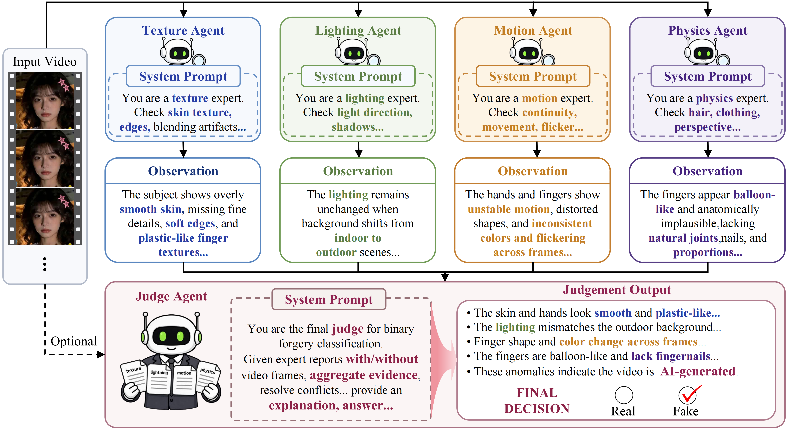
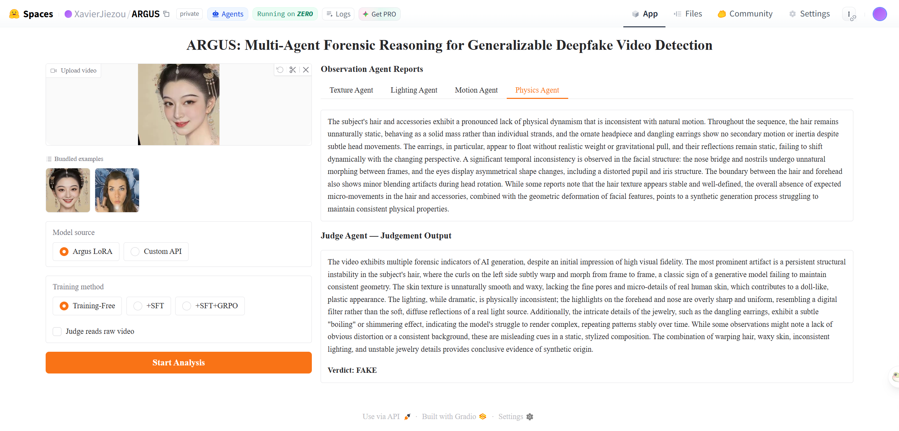
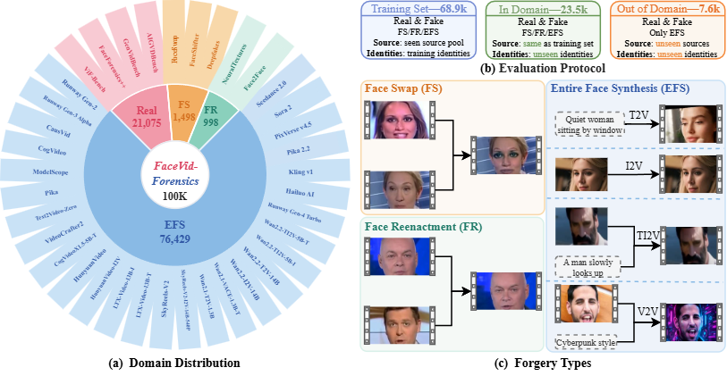
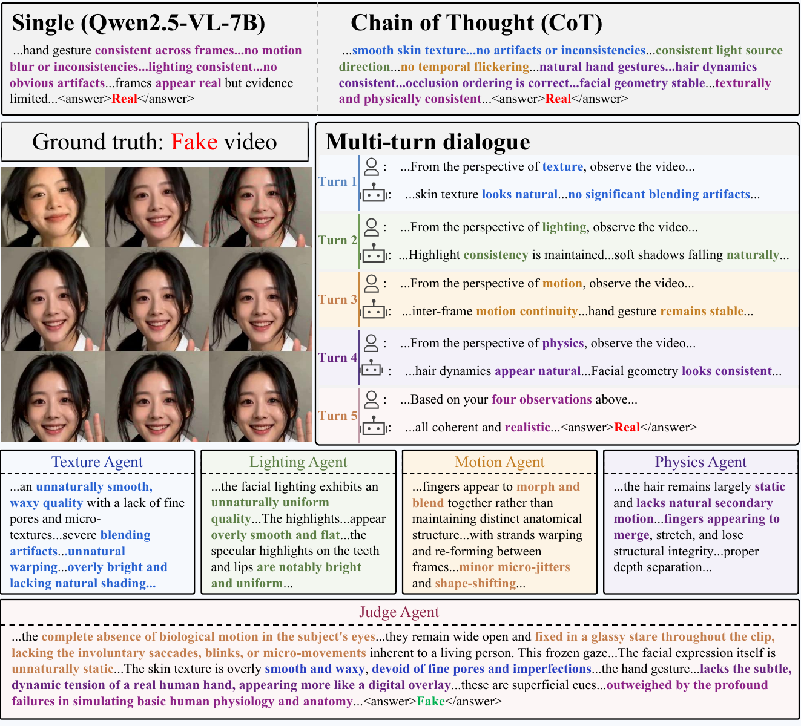
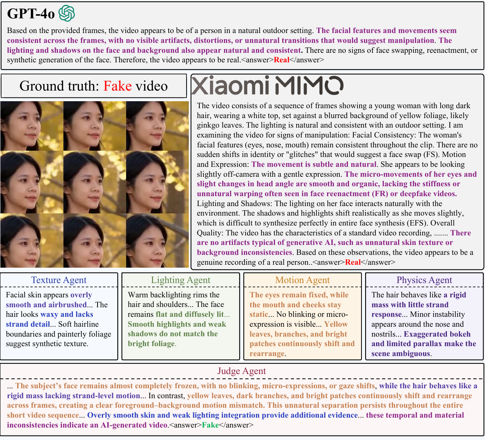
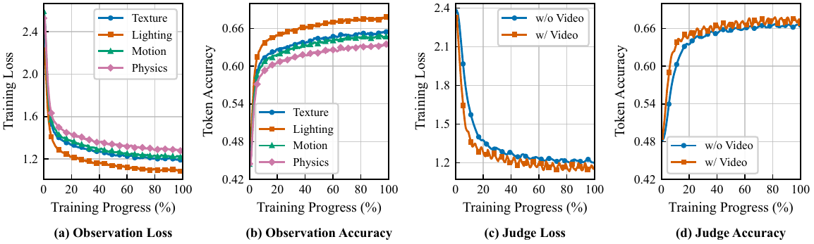

<div align="center">


# ARGUS

Multi-Agent Forensic Reasoning for Generalizable Deepfake Video Detection

[](https://xavierjiezou.github.io/ARGUS/)
[](https://huggingface.co/spaces/XavierJiezou/ARGUS)
[](https://huggingface.co/XavierJiezou/argus-models)
[](https://huggingface.co/datasets/XavierJiezou/ARGUS-datasets)
[](LICENSE)
<!--[](ARXIV_LINK_TO_BE_ADDED)-->



[Open the ARGUS Online Demo](https://huggingface.co/spaces/XavierJiezou/ARGUS)



</div>

## 1. Install the environment

```bash
git clone https://github.com/XavierJiezou/ARGUS.git
cd ARGUS

conda create -n argus python=3.12 -y
conda activate argus
bash create_env.sh
```

## 2. Prepare the dataset



Download FaceVid-Forensics-100K from
[Hugging Face](https://huggingface.co/datasets/XavierJiezou/ARGUS-datasets) (20.9 GB) into
the repository:

```bash
hf download XavierJiezou/ARGUS-datasets \
  --repo-type dataset \
  --local-dir data/FaceVid-Forensics-100K
```

The `frames/` tree is not shipped with the dataset. Decode it once so that every
training and inference run reads PNG files instead of re-decoding the same videos:

```bash
python -m src.extract_video_frames FaceVid-Forensics-100K/splits/train.json \
  --root-dir FaceVid-Forensics-100K \
  --workers 8 \                                  
  --backend auto
```

Organize the directory as follows:

```text
ARGUS/                            # repository root
└── data/FaceVid-Forensics-100K/
    ├── splits/
    │   ├── train.json
    │   ├── test.json
    │   └── ood.json
    ├── videos/                   # <split>/<label>/<dataset>/.../<video>.mp4
    ├── frames/                   # <split>/<label>/<dataset>/.../<video>.mp4/*.png
    ├── observations/
    │   ├── raw/
    │   └── aggregated/
    └── explanation/
        ├── raw/
        └── aggregated/
```

## 3. Download the Base Model

```bash
modelscope download --model Qwen/Qwen2.5-VL-3B-Instruct --local_dir checkpoints/Qwen2.5-VL-3B-Instruct
modelscope download --model Qwen/Qwen2.5-VL-7B-Instruct --local_dir checkpoints/Qwen2.5-VL-7B-Instruct
modelscope download --model Qwen/Qwen2.5-VL-32B-Instruct --local_dir checkpoints/Qwen2.5-VL-32B-Instruct
modelscope download --model OpenGVLab/InternVL3_5-8B --local_dir checkpoints/InternVL3_5-8B
```

After downloading, the files should be arranged as follows:

```text
ARGUS/      
└── checkpoints/
    ├── Qwen2.5-VL-3B-Instruct/
    ├── Qwen2.5-VL-7B-Instruct/
    └── Qwen2.5-VL-32B-Instruct/
```

## 4. Training

### SFT

1. Four Observation Agents

```bash
bash scripts/train_observers.sh
```

2. The Judge Agent

- Judge without video

```bash
python -m src.train sft --model checkpoints/Qwen2.5-VL-7B-Instruct --role judge \
  --dataset data/derived/judge_text.jsonl \
  --output outputs/Qwen2.5-VL-7B/sft_text --gpus 0,1,2,3
```

- Judge with video

```bash
python -m src.train sft --model checkpoints/Qwen2.5-VL-7B-Instruct --role judge --with-video \
  --dataset data/derived/judge_video.jsonl \
  --output outputs/Qwen2.5-VL-7B/sft_video --gpus 0,1,2,3
```

### GRPO

- Judge without video

```bash
python -m src.train grpo --model checkpoints/Qwen2.5-VL-7B-Instruct \
  --dataset data/derived/judge_grpo_text.jsonl \
  --adapter outputs/Qwen2.5-VL-7B/sft_text/checkpoint-1000 \
  --output outputs/Qwen2.5-VL-7B/grpo_text --gpus 0,1,2,3
```
- Judge with video

```bash
python -m src.train grpo --model checkpoints/Qwen2.5-VL-7B-Instruct --with-video \
  --dataset data/derived/judge_grpo_video.jsonl \
  --adapter outputs/Qwen2.5-VL-7B/sft_video/checkpoint-1000 \
  --output outputs/Qwen2.5-VL-7B/grpo_video --gpus 0,1,2,3
```

## 5. Inference

The weights can be downloaded from
[ARGUS Models](https://huggingface.co/XavierJiezou/argus-models):

```bash
hf download XavierJiezou/argus-models --local-dir weights
```

After downloading, the files should be arranged as follows:

```text
ARGUS/                            # repository root
└── weights/qwen2_5_vl_7b/main/
    ├── shared/lora/
    │   ├── texture/
    │   ├── lighting/
    │   ├── motion/
    │   └── physics/
    ├── sft_text/lora/judge/      # Judge reads the four reports only
    ├── sft_video/lora/judge/     # Judge reads the reports and the frames
    ├── grpo_text/lora/judge/
    └── grpo_video/lora/judge/    # main result
```


- Inference one video and read the verdict on the terminal

```bash
python -m src.argus_infer argus \
  --video samples/example.mp4 \
  --base-model checkpoints/Qwen2.5-VL-7B-Instruct \
  --texture-lora weights/qwen2_5_vl_7b/main/shared/lora/texture \
  --lighting-lora weights/qwen2_5_vl_7b/main/shared/lora/lighting \
  --motion-lora weights/qwen2_5_vl_7b/main/shared/lora/motion \
  --physics-lora weights/qwen2_5_vl_7b/main/shared/lora/physics \
  --judge-lora weights/qwen2_5_vl_7b/main/grpo_video/lora/judge \
  --with-video
```

- Inference with the pretrained weights

```bash
python -m src.argus_infer argus \
  --input data/FaceVid-Forensics-100K/splits/ood.json \
  --dataset-root data/FaceVid-Forensics-100K \
  --base-model checkpoints/Qwen2.5-VL-7B-Instruct \
  --observer-lora-root weights/qwen2_5_vl_7b/main/shared/lora \
  --judge-lora weights/qwen2_5_vl_7b/main/grpo_video/lora/judge \
  --with-video --num-frames 16 \
  --output outputs/argus/argus_video_ood.json
```

- Inference on the training-free settings

> For open-source models, deploy the model with **[vLLM](https://github.com/vllm-project/vllm)** and set the deployed endpoint via `--base-url`. For closed-source models, replace `--base-url` and `--api-key` with the corresponding API endpoint and credentials.

```bash
python -m src.inference argus \
  --input data/FaceVid-Forensics-100K/splits/ood.json \
  --dataset-root data/FaceVid-Forensics-100K \
  --base-url http://127.0.0.1:8000/v1 \
  --model-name Qwen2.5-VL-7B-Instruct \
  --api-key YOUR_API_KEY \
  --with-video --num-frames 16 --concurrency 8 \
  --output outputs/baselines/training_free_ood.json
```

## 6. Evaluation

```bash
python -m src.evaluate outputs/argus/argus_video_ood.json
```

## 7. Visualizations

### Reasoning Strategies



### Qualitative Comparison with Open- and Closed-Source MLLMs



### Training dynamics



## Citation

If you find ARGUS useful for your research, please consider citing our work:

```bibtex
@misc{argus,
      title={Multi-Agent Forensic Reasoning for Generalizable Deepfake Video Detection}, 
      author={Xuechao Zou and Shun Zhang and Kai Li and Yi Zhou and Xinyu Sun and Yuhui Chen and Zhe Wu and Congyan Lang and Junliang Xing},
      year={2026},
      eprint={2608.06865},
      archivePrefix={arXiv},
      primaryClass={cs.CV},
      url={https://arxiv.org/abs/2608.06865}, 
}
```

## License

This project is licensed under the Apache License 2.0. See [LICENSE](LICENSE) for
the official license text.
